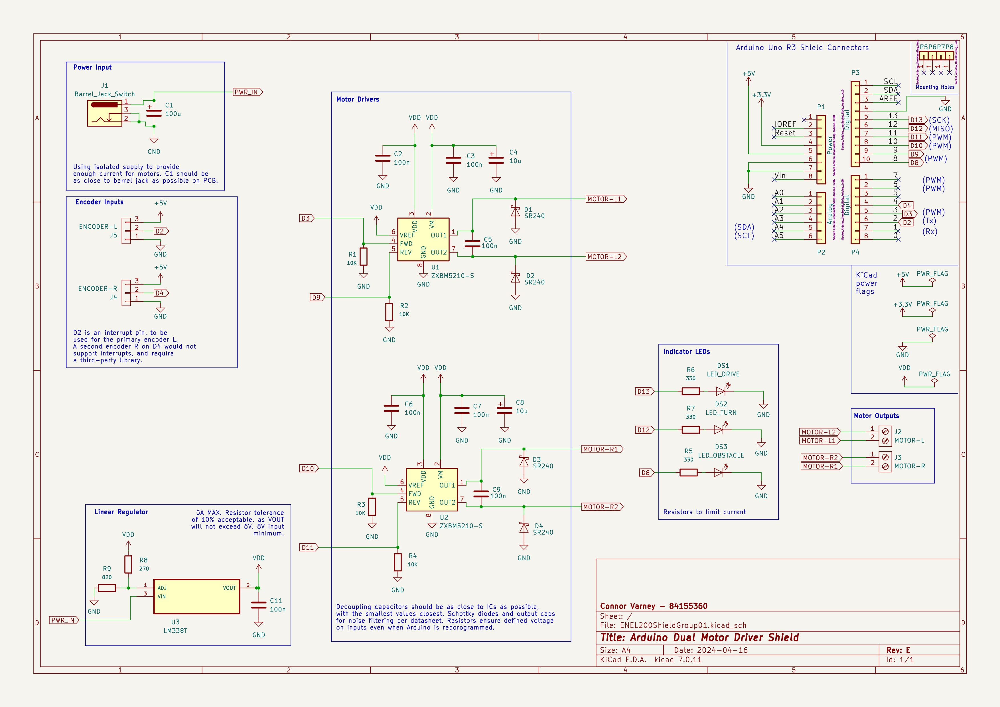

# Arduino ZXBM Robot
Chassis, PCB and Software to create an Arduino robot, including a custom motor driver shield based on the [ZXBM5210 motor driver](https://www.diodes.com/assets/Datasheets/products_inactive_data/ZXBM5210.pdf), and a chassis to hold two ["TT" geared DC motors](https://www.adafruit.com/product/3777). 

The Arduino shield design can be found in [hw](hw), and the robot chassis design can be found in [chassis](/chassis). Modules for interfacing with the shield can be found in [lib](/lib), and example control code is in [src](/src).

## Chassis
This chassis is specifically designed for the **Univeristy of Canterbury** Arduino Uno clone. The mount positions will need to be modified to be used with a standard Arduino Uno.

This is designed for 3D printing. Support will only be needed for the overhangs on the top of the chassis that are used to support the Arduino.

## Control Hardware

Designed in KiCad. [MotorDriverShield.kicad_pcb](hw/MotorDriverShield.kicad_pcb) and [MotorDriverShield.kicad_sch](hw/MotorDriverShield.kicad_sch) can be loaded into KiCad to modify the schematic or export Gerber files.

### Schematic

### PCB

