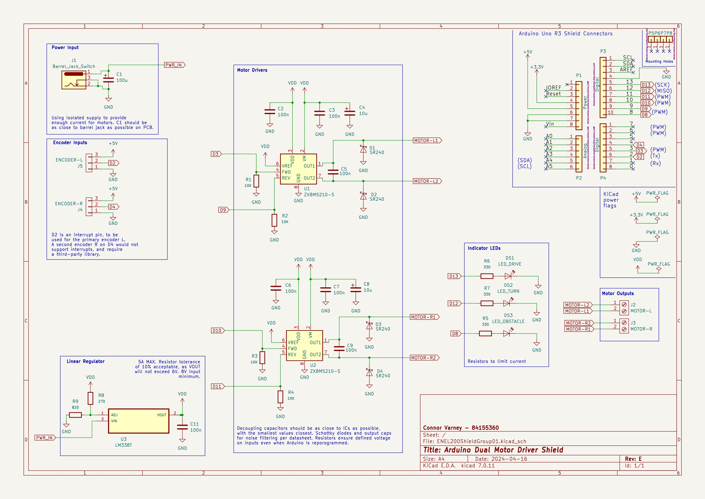
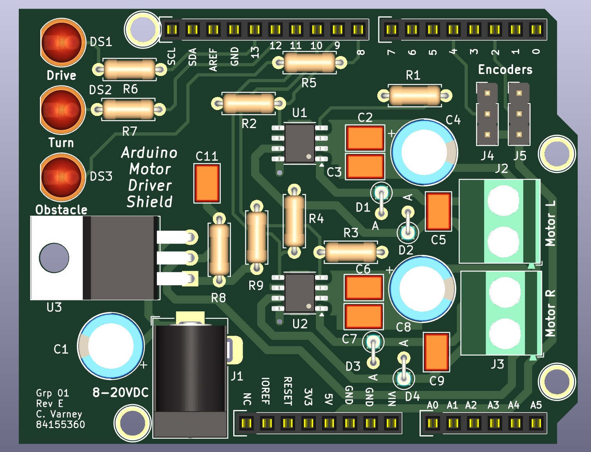

# Control Hardware

Designed in KiCad. [MotorDriverShield.kicad_pcb](MotorDriverShield.kicad_pcb) and [MotorDriverShield.kicad_sch](MotorDriverShield.kicad_sch) can be loaded into KiCad to modify the schematic or export Gerber files.

## Schematic

## PCB
